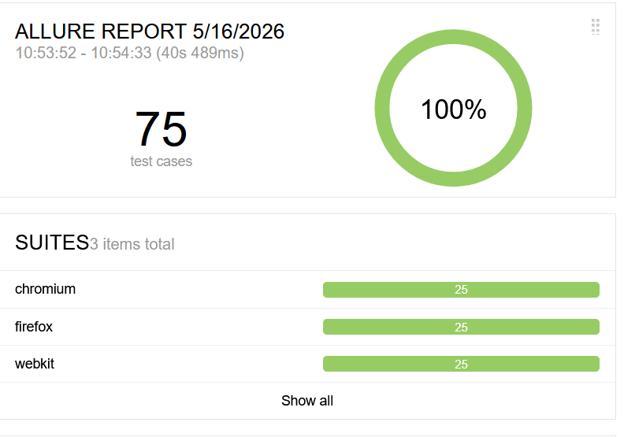

# QA Automation Suite

End-to-end and API test automation framework built with Playwright and TypeScript.

## Tech Stack

- Playwright
- TypeScript
- GitHub Actions CI/CD
- Page Object Model pattern

## Test Stats

- 10+ UI tests across 2 test suites
- 6 API tests covering full CRUD operations
- Tests run on Chromium, Firefox and WebKit
- CI/CD with GitHub Actions on every push

## Project Structure

    qa-automation-suite/
    ├── pages/
    ├── tests/
    │   ├── ui/
    │   └── api/
    └── playwright.config.ts

## Test Coverage

### UI Tests — Saucedemo

- Login successful, failed, locked user, empty fields
- Product filtering
- Add to cart and checkout flow
- Logout

### API Tests — Reqres

- GET users list
- GET single user
- GET non-existent user 404
- POST create user
- PUT update user
- DELETE user

## How to Run

Install dependencies

    npm install
    npx playwright install

Run all tests

    npx playwright test

Run only UI tests

    npx playwright test tests/ui

Run only API tests

    npx playwright test tests/api

## Test Reports

